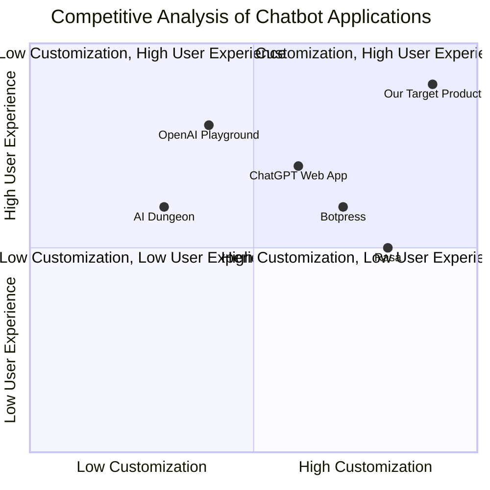

## Original Requirements
The boss wants to create a web application that allows users to chat with OpenAI. The architecture of the application should be clear, with decoupled features including but not limited to configuration, interface, and robot connection. The application should not use the CLI method, but should allow users to chat with ChatGPT in the browser. 

Users should be able to customize the OpenAI API key and API model in the config.yaml file. The UI should be elegant and can use mainstream UI frameworks such as Bootstrap, Material UI, etc., without the need for front-end and back-end separation. The chat window should display user input on the left and ChatGPT responses on the right, similar to WeChat, and should include an avatar for ChatGPT. 

Communication should be asynchronous using Axios. The chat interface should return JSON data for easy front-end use. The application should include detailed logging for debugging, and comments in the code should be very detailed. Monitoring and logging features should be included to assist in debugging and maintenance. 

The JS file should extract initialization functions, message processing functions, etc., to keep the code clean. The application should display a "typing" status to optimize user experience. The right side of the chat window should include a selection box for choosing the model, with supported models displayed and the default being the model read from the config.yaml file. 

The right side of the chat window should also display the balance and usage situation for the API key, using the request to call the https://api.openai.com/v1/usage interface, and should refresh regularly with the refresh time configured in a unified configuration file. The chat window should include a file upload feature to allow users to add files of various formats for fine-tuning the large language model. 

The application should include error handling and detailed logging, including but not limited to situations where the API request fails. Error handling should be standardized and improved, such as using custom exceptions and unified exception capture at the top level.

## Product Goals
```python
[
    "Create a web application for users to chat with OpenAI with a clear and decoupled architecture",
    "Provide an elegant UI with user-friendly features such as model selection, API key balance display, and file upload",
    "Ensure robust error handling and detailed logging for easy debugging and maintenance"
]
```

## User Stories
```python
[
    "As a user, I want to chat with OpenAI in the browser so that I can interact with the AI model easily",
    "As a user, I want to customize the OpenAI API key and model in a configuration file so that I can use my preferred settings",
    "As a user, I want to see the balance and usage of my API key so that I can manage my usage effectively",
    "As a user, I want to upload files for the AI model to process so that I can fine-tune the model with my data",
    "As a developer, I want detailed logging and error handling so that I can debug and maintain the application effectively"
]
```

## Competitive Analysis
```python
[
    "OpenAI Playground: The official platform for interacting with OpenAI models. It has a clear UI and robust features, but does not allow customization of API keys or models",
    "ChatGPT Web App: A web application for chatting with OpenAI's GPT-3 model. It has a simple UI and allows file upload, but does not display API key balance or usage",
    "AI Dungeon: A game that uses OpenAI's models for text-based adventures. It has a unique use case, but does not allow API key or model customization",
    "Rasa: An open-source chatbot framework. It allows customization of models and has robust error handling, but does not integrate with OpenAI",
    "Botpress: An open-source chatbot platform. It allows customization of models and has a clear UI, but does not integrate with OpenAI or display API key balance or usage"
]
```

## Competitive Quadrant Chart


## Requirement Analysis
The product should be a web application that allows users to chat with OpenAI. It should have a clear and decoupled architecture, with features such as model selection, API key balance display, file upload, and detailed logging. The UI should be elegant and user-friendly, and the application should have robust error handling.

## Requirement Pool
```python
[
    ("Create a web application with a clear and decoupled architecture", "P0"),
    ("Implement a chat interface with OpenAI that returns JSON data", "P0"),
    ("Design an elegant UI with model selection, API key balance display, and file upload features", "P0"),
    ("Include detailed logging and robust error handling", "P0"),
    ("Optimize user experience with features like a 'typing' status and avatar for ChatGPT", "P1")
]
```

## UI Design draft
The application should have a clean and modern design, with a chat window on the left and a panel on the right. The chat window should display user input on the left and ChatGPT responses on the right, with a 'typing' status and an avatar for ChatGPT. The panel on the right should include a selection box for choosing the model, a display for the API key balance and usage, and a file upload button.

## Anything UNCLEAR
There are no unclear points.