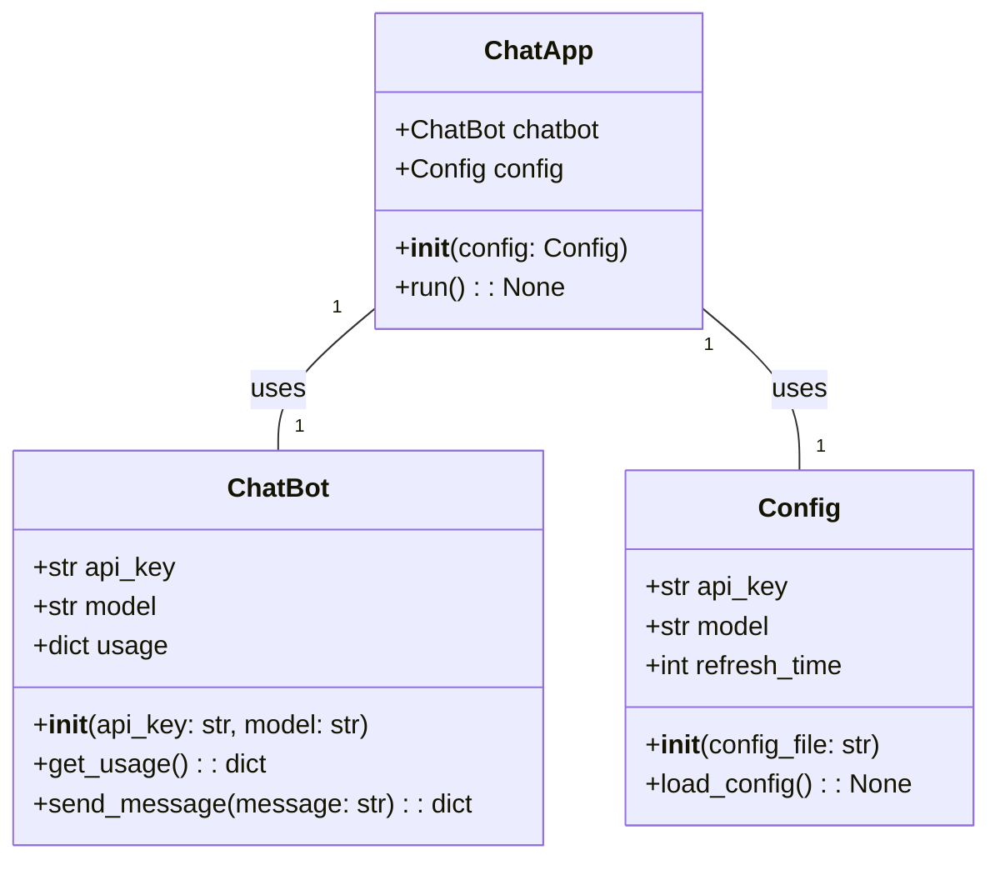
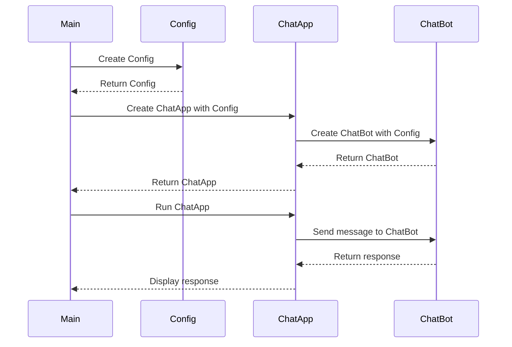

## Implementation approach
We will use Flask as the web framework due to its simplicity and flexibility. Flask-SocketIO will be used for real-time communication between the client and server. The OpenAI API will be used for the chatbot functionality. The front-end will be built using Bootstrap for its wide range of components and responsive design. We will use PyYAML to handle the configuration file. For logging, we will use Python's built-in logging module. Error handling will be done using Python's built-in exceptions and we will create custom exceptions where necessary.

## Python package name
```python
"openai_chatbot"
```

## File list
```python
[
    "main.py",
    "config.yaml",
    "chatbot.py",
    "static/css/styles.css",
    "templates/index.html",
    "utils.py",
    "exceptions.py",
    "logging.conf"
]
```

## Data structures and interface definitions


## Program call flow


## Anything UNCLEAR
The requirement is clear to me.